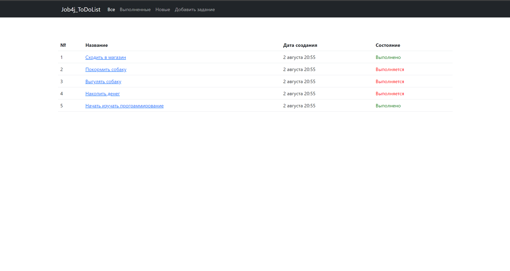
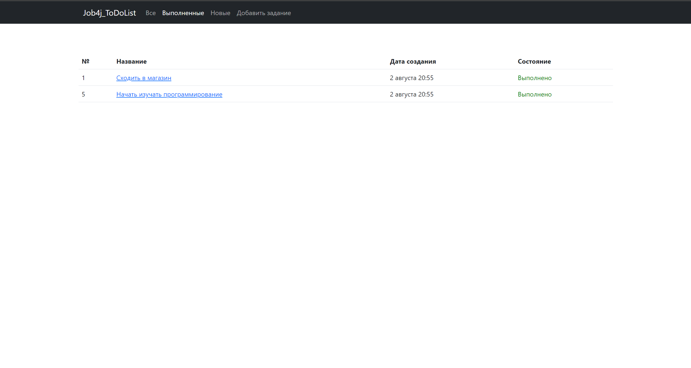
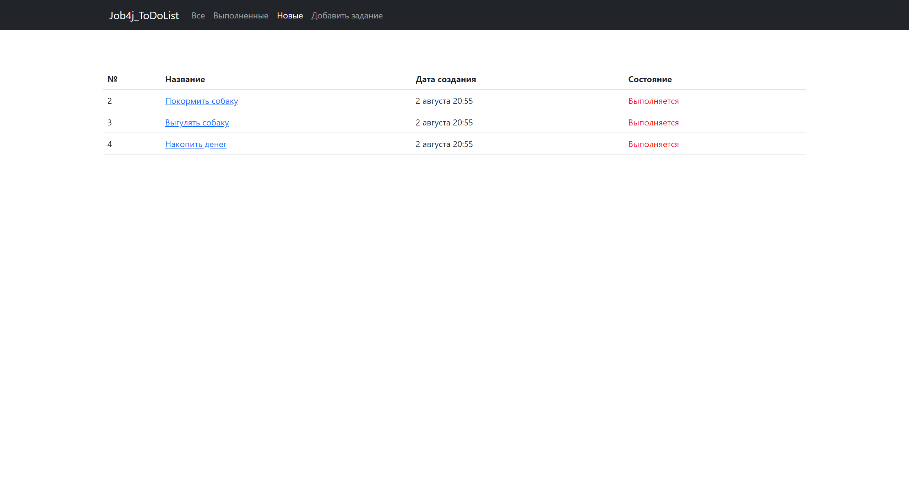
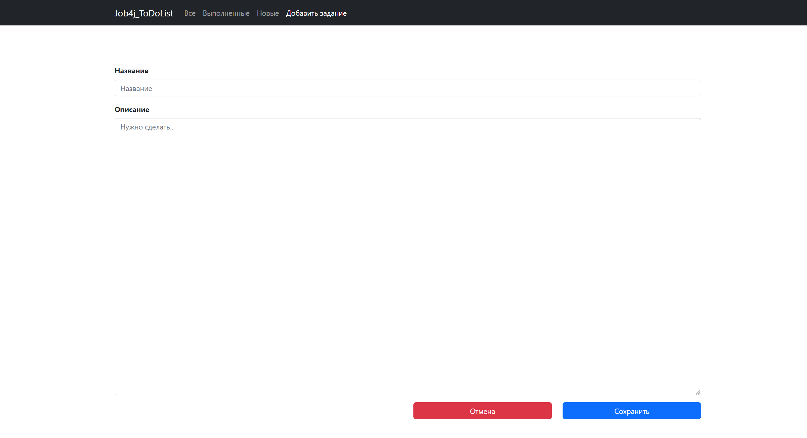
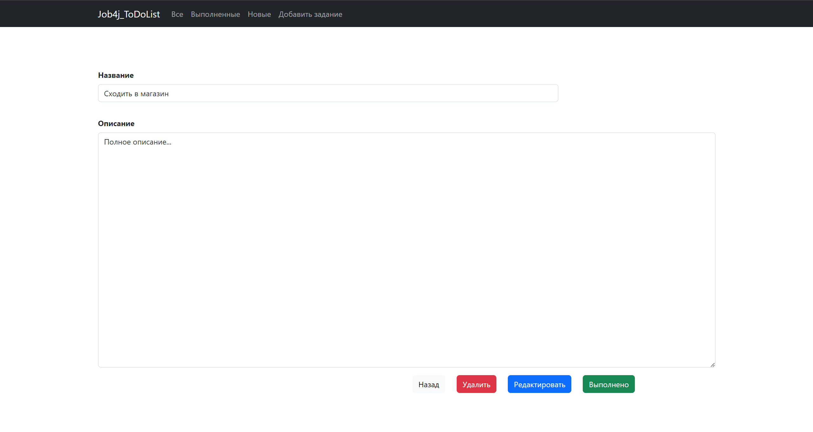
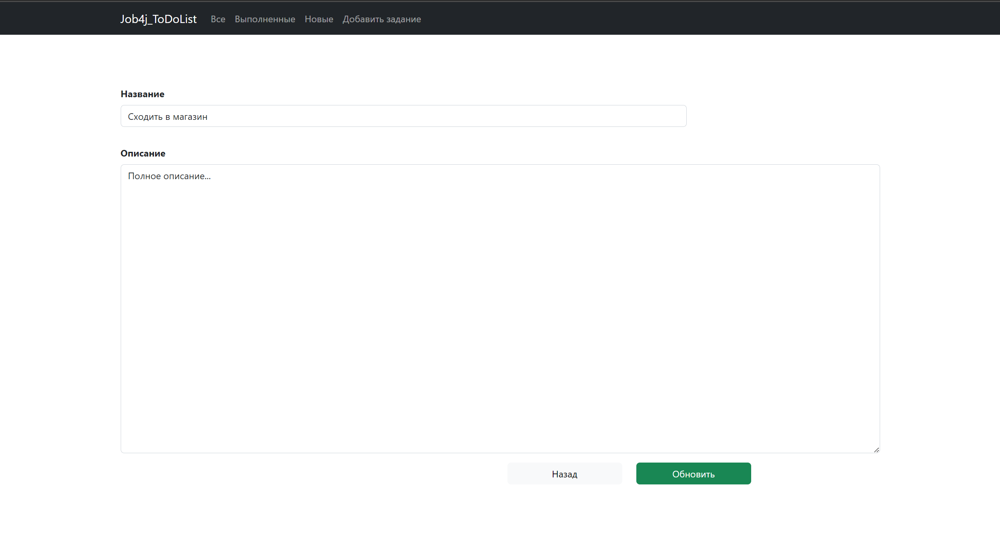

# Кинотеатр

## О проекте

**Проект представляет собой web-приложение со списком дел (задач). Сервис состоит из:**

* главной страницы, которая демонстрирует весь список дел (задач);
* страницы с только выполненными делами (задачами);
* страницы с только новыми делами (невыполненными);
* страницы с возможностью добавления нового дела (задачи);
* страницы на которой есть возможность поставить делу (задаче) отметку "выполнено";
* страницы на которой есть возможность редактирования задач (дел).

## Инструменты

- **Java 17**
- **Spring Boot 2.7.6**
- **PostgreSQL 14**
- **HTML 5**
- **CSS**
- **Thymeleaf 2.7.6**
- **Bootstrap 4.4.1**
- **H2database 1.4.2**
- **Hibernate 5.6**
- **Mapstruct 1.5**
- **Junit 5**
- **Mockito 4.8.0**
- **Liquibase 4.15.0**
- **Maven 3.8**
- **Git**

## Сборка и запуск<br>

- **Создать БД**

``` shell 
create database job4j_todo;
```

- **Запустить проект по команде**

``` shell 
mvn spring-boot:run -Pproduction
```

- **Перейти в браузере по ссылке**

``` shell 
http://localhost:8080/
```

## Взаимодействие с приложением<br>

### Страница со списком всех задач:

- При нажатии на название задачи будет выполнен переход на страницу с полным описанием задачи
  и возможностью редактирования, удаления или постановки отметки "выполнено" для задачи.



### Страница со списком выполненных задач:

- При нажатии на название задачи будет выполнен переход на страницу с полным описанием задачи
  и возможностью редактирования, удаления или постановки отметки "выполнено" для задачи.



### Страница со списком новых (невыполненных) задач:

- При нажатии на название задачи будет выполнен переход на страницу с полным описанием задачи
  и возможностью редактирования, удаления или постановки отметки "выполнено" для задачи.



### Страница с возможностью создания новой задачи:



### Страница с полным описанием задачи:

- При нажатии на кнопку "удалить" - будет выполнено удаление задачи;
- При нажатии на кнопку "редактировать" - будет выполнен переход на страницу редактирования задачи;
- При нажатии на кнопку "выполнено" - задача будет числиться как выполненная.



### Страница для редактирования задачи:

- При нажатии на кнопку "обновить" - задача будет обновлена согласно данным в форме редактирования.
  


## Контакты для связи<br>

<a href="https://t.me/OvercomingJunk" target="blank"></a>

